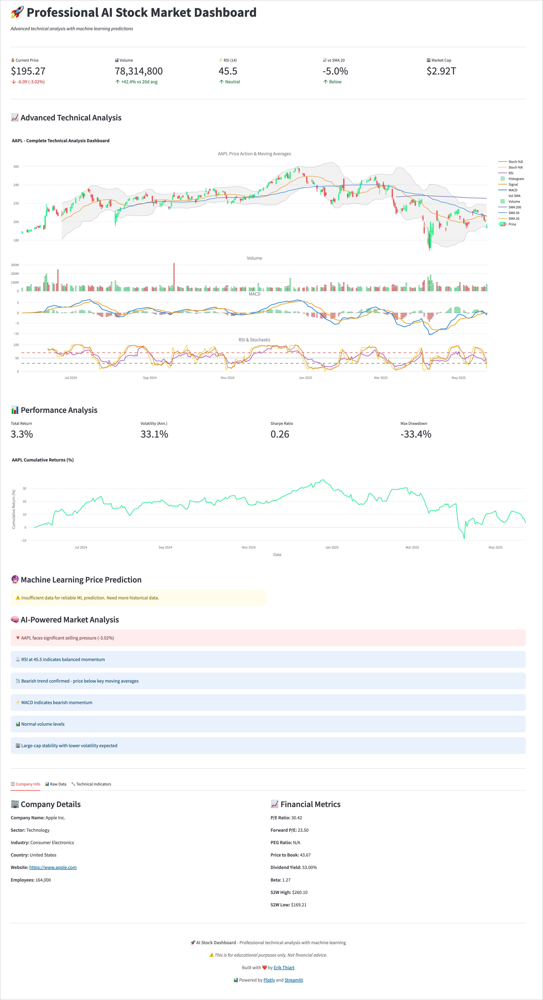
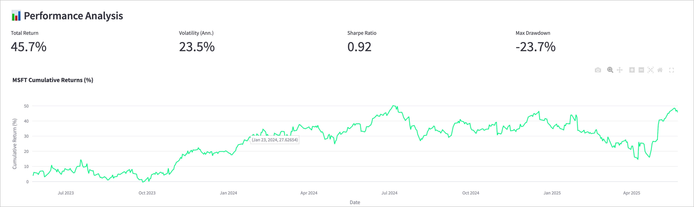
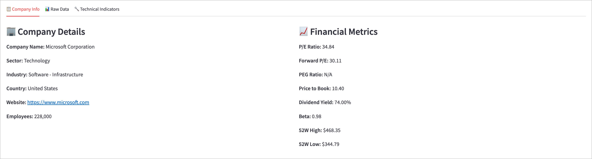

# 🚀 AI-Powered Stock Market Dashboard

[](https://www.python.org/)
[](https://streamlit.io/)
[](LICENSE)
[](https://github.com/erikthiart/ai-stock-dashboard)

> **Professional-grade stock analysis with machine learning predictions and real-time technical indicators**

A comprehensive, AI-powered stock market dashboard that combines advanced technical analysis, machine learning price predictions, and intelligent market insights in a beautiful, interactive interface.



---

## 🔎 Dataflow Trace 模式（`dataflow/` + `trace_app.py`）

原 `stock_dashboard.py` 把 ticker 输入、yfinance 拉取/缓存、RSI/MACD/布林带、
ML 预测、AI 调用、多标签页渲染全糊在一起。现已拆成五阶段流水线，每段一个
统一 trace 钩子（输入列名、时区、行数、耗时、异常全部可查）：

```
dataflow/
  config.py       # 全局配置（TTL、AI 密钥、最小训练样本等，支持环境变量）
  trace.py        # Tracer / StageTrace：with tracer.step(...) 记录一切
  cache.py        # QuoteCache（行情缓存）+ FingerprintMemo（计算结果复用）
  fetch.py        # ticker -> yfinance -> 缓存/旧缓存/demo 降级
  indicators.py   # SMA/EMA/MACD/RSI/布林带/ATR/Stoch，除零一律 NaN
  predict.py      # 特征工程 + RandomForest，样本不足返回 NaN 预测
  ai.py           # OpenAI 兼容调用，缺密钥/失败 -> 本地规则，不跳标签
  render.py       # 六个标签页独立渲染，单标签异常只隔离该标签
  pipeline.py     # 五阶段编排 + per-stage 兜底，整页永不崩
trace_app.py      # Flask(5050)：按 ticker 展示各阶段耗时/数据/降级横幅
templates/trace.html
tests/            # pytest：空数据、单行、除零、缓存命中次数、降级、切 ticker
```

### 三个关键取舍（已落进代码）

1. **缓存键粒度 = ticker + UTC 日期区间**：`period="1y"` 是滑动窗口，
   不同日期含义不同，因此先归一化成 `(ticker, start_date, end_date)`
   （`cache.quote_key`）。
2. **命中 vs 最新 & AI 失败策略**：默认 60s TTL（`STOCK_QUOTE_TTL`）内
   命中即复用不联网；过期后联网，失败按 `stale-if-error` 回退旧缓存；
   再失败用内置合成数据占位（页面显著标注 DEMO）。AI 缺密钥不发请求、
   请求失败退回本地规则——**标签页永远保留**，只在横幅与标签上标降级。
3. **刷新复用边界**：行情按 TTL 复用；指标/预测/AI 按输入**内容指纹**
   memo，行情不变就不重算/不重训/不重复调用；渲染每次刷新都重算。
   指标样本不足或除零（零量、平盘）一律返回 NaN，不抛异常。

### 运行

```bash
python -m pytest -q          # 全部单测（含缓存命中次数断言）
python trace_app.py          # http://127.0.0.1:5050 ，换 ticker 观察耗时/降级
```

可选环境变量：`STOCK_QUOTE_TTL`、`STOCK_CACHE_PATH`、`STOCK_DEMO_FALLBACK=0`、
`OPENAI_API_KEY`、`OPENAI_BASE_URL`、`OPENAI_MODEL`、`ML_MIN_TRAIN_ROWS`。

---

## ✨ Features

### 🤖 **Artificial Intelligence**
- **Machine Learning Price Prediction** - Random Forest model with 30+ technical features
- **AI Market Analysis** - Natural language insights based on technical indicators
- **Feature Importance Analysis** - Understand what drives price movements
- **Model Performance Metrics** - Train/test accuracy with confidence levels

### 📈 **Advanced Technical Analysis**
- **Professional Charts** - Multi-panel candlestick charts with technical overlays
- **20+ Technical Indicators** - RSI, MACD, Bollinger Bands, Moving Averages, Stochastic
- **Volume Analysis** - Volume trends and confirmation signals
- **Performance Metrics** - Sharpe ratio, volatility, maximum drawdown

### 🎯 **Real-Time Data**
- **Live Stock Data** - Real-time prices from Yahoo Finance
- **Multiple Timeframes** - 1M to 5Y analysis periods
- **Popular Stock Presets** - Quick access to FAANG+ stocks
- **Custom Symbol Input** - Analyze any publicly traded stock

### 🎨 **Professional Interface**
- **Dark Theme** - Easy on the eyes for extended analysis
- **Responsive Design** - Works perfectly on desktop and mobile
- **Interactive Charts** - Zoom, pan, and explore data
- **Organized Tabs** - Clean separation of different analysis types


## 🚀 Quick Start

### Prerequisites

```bash
Python 3.8 or higher
```

### Installation

1. **Clone the repository**
```bash
git clone https://github.com/erikthiart/ai-stock-dashboard.git
cd ai-stock-dashboard
```

2. **Install dependencies**
```bash
pip install -r requirements.txt
```

3. **Run the application**
```bash
streamlit run stock_dashboard.py
```

4. **Open your browser**
```
Navigate to http://localhost:8501
```


## 📦 Dependencies

```
streamlit>=1.28.0
yfinance>=0.2.18
pandas>=1.5.0
numpy>=1.24.0
plotly>=5.15.0
scikit-learn>=1.3.0
```

## 🎮 How to Use

### 1. **Select Your Stock**
- Choose from popular presets (Apple, Tesla, Google, etc.)
- Or enter any stock symbol manually
- Select your preferred analysis timeframe

### 2. **Explore the Analysis**
- **Main Dashboard**: Key metrics and price changes
- **Technical Charts**: Advanced multi-panel analysis
- **Performance**: Risk metrics and cumulative returns
- **AI Predictions**: Machine learning price forecasts
- **Market Analysis**: AI-generated insights

### 3. **Understand the Insights**
- 🟢 **Green indicators**: Bullish signals
- 🔴 **Red indicators**: Bearish signals  
- 🟡 **Yellow indicators**: Neutral/mixed signals
- ⚠️ **Warning indicators**: Overbought/oversold conditions



## 🧠 Machine Learning Model

Our AI uses a **Random Forest Regressor** trained on 30+ features including:

- **Price-based features**: Returns, volatility, price changes
- **Technical indicators**: RSI, MACD, moving averages
- **Volume features**: Volume ratios and trends  
- **Lag features**: Historical price and volume data
- **Statistical features**: Rolling means and standard deviations

**Model Performance:**
- Real-time training on historical data
- Cross-validation with train/test splits
- Feature importance analysis
- Confidence metrics displayed


## 📊 Technical Indicators

| Indicator | Purpose | Interpretation |
|-----------|---------|----------------|
| **RSI** | Momentum | >70 Overbought, <30 Oversold |
| **MACD** | Trend | Signal line crossovers |
| **Bollinger Bands** | Volatility | Price vs. bands position |
| **Moving Averages** | Trend | Price vs. MA relationships |
| **Stochastic** | Momentum | %K and %D oscillator |
| **Volume** | Confirmation | Volume vs. average ratios |

## 🎯 Use Cases

### 📈 **For Traders**
- Quick technical analysis of any stock
- AI-powered price predictions for next trading day
- Volume confirmation signals
- Multiple timeframe analysis

### 💼 **For Investors**
- Long-term performance metrics
- Risk assessment (volatility, drawdown)
- Company fundamental information
- Market trend analysis

### 🎓 **For Learning**
- Understanding technical indicators
- Machine learning in finance
- Market behavior patterns
- Professional chart analysis



## ⚠️ Disclaimer

**This tool is for educational and informational purposes only.**

- Not financial advice or investment recommendations
- Past performance doesn't guarantee future results
- Always do your own research before investing
- Consider consulting with financial professionals
- Markets involve risk and potential loss of capital

## 🛠️ Technical Architecture

```
├── stock_dashboard.py      # Main application
├── requirements.txt        # Dependencies
├── README.md              # Documentation
└── screenshots/           # UI screenshots
    ├── main_dashboard.jpg
    ├── technical_analysis.jpg
    ├── ml_predictions.jpg
    ├── performance_metrics.jpg
    ├── ai_analysis.jpg
    └── company_info.jpg
```

## 🤝 Contributing

Contributions are welcome! Please feel free to submit a Pull Request.

1. Fork the repository
2. Create your feature branch (`git checkout -b feature/AmazingFeature`)
3. Commit your changes (`git commit -m 'Add some AmazingFeature'`)
4. Push to the branch (`git push origin feature/AmazingFeature`)
5. Open a Pull Request

## 📝 License

This project is licensed under the MIT License - see the [LICENSE](LICENSE) file for details.

## 🌟 Acknowledgments

- **Yahoo Finance** for providing free stock data
- **Streamlit** for the amazing web framework
- **Plotly** for interactive visualizations
- **scikit-learn** for machine learning capabilities

## 📞 Support

If you find this project helpful, please give it a ⭐ on GitHub!

For questions or issues:
- Open an [Issue](https://github.com/erikthiart/ai-stock-dashboard/issues)

---

<div align="center">

**Built with ❤️ and Python**

[](https://github.com/erikthiart)
[](https://linkedin.com/in/erikthiart)

</div>
